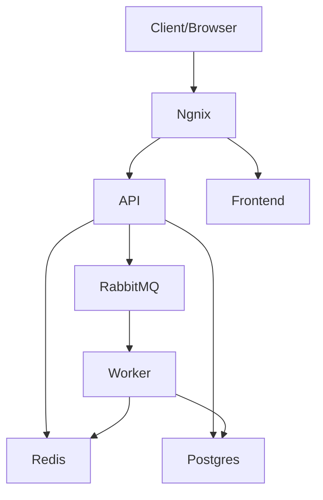

## try-celery

```mermaid
graph TD;
Client/Browser --> Ngnix;
Ngnix --> API
Ngnix --> Frontend

API --> Redis
API --> Postgres
API --> RabbitMQ
RabbitMQ --> Worker
Worker --> Postgres
Worker --> Redis
```
